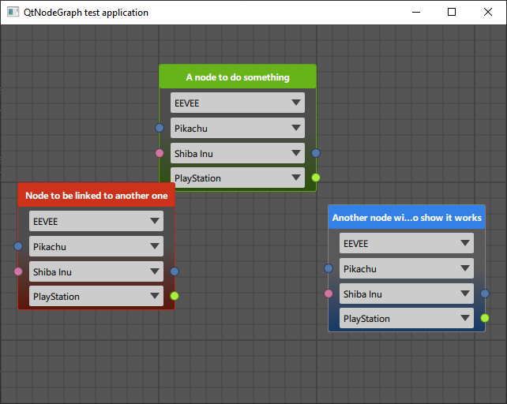

# QtNodeGraph
Application test to develop a Node Graph library (to be extracted into a Qt library).

Written in C++/QML/JavaScript using Qt 6.1. 
Development done on Window 10 for now, other systems not tested yet.

## What's done?
- Graphics only (QML/JavaScript)
    - Node box
    - Adaptative size of the node box to its content (height only)
    - Easy dynamic inner-widget creation (combobox)
    - Easy inner-widget creation
    - Display ports (input, output, both or none)
    - Select and move node boxes
    - Z-order on selection (mouse right/left click)
    - Scene scale (mouse wheel)

## What to do?
- Graphics only (QML/JavaScript)
    - Dark/light themes
    - Edit node title
    - Resize node box on width
    - Add icon to the node title
    - Add more prebuild inner-widgets
    - Add port type info
    - Connect ports with lines (type matching)
    - Connect ports with Bezier curves?
- Model conception (load & save)
- Node behavior
- Connection behavior
- Much more stuff...
